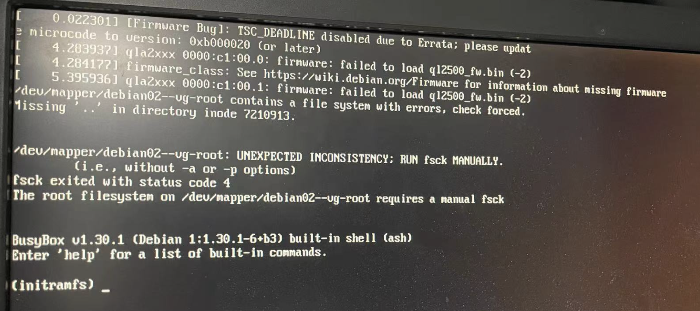

### 西安管线项目操作系统级故障报告

#### 1. 发生时间
 * 2023-06-09

#### 2. 故障现象
 * 主要数据库**15服务器**，操作系统进入只读模式，导致无法进行其余操作。系操作系统文件损坏，属于基础环境层问题，与应用层无关。

#### 3. 处理情况
 * 已使用操作系统自带修复工具修复系统文件损坏，目前操作系统使用正常。

#### 4. 事件回顾
 * 接院方通知**2023-06-09**通知礼拜天机房要停电，需要对相关服务器进行关机操作，下班之时对管线系统部署的**19、15服务器**进行关机操作。**19服务器**停止软件服务关机正常，**15服务器**停止软件服务时，**提示"sudo docker-compose down XXXXXXX: Read-only file system"**，服务无法停止无论做何种操作都是此提示，怀疑是磁盘占用已满检查后磁盘占用正常。经重启之后提示如下：

查阅官方资料、互联网结果是操作系统文件丢失或者损坏导致操作系统出现问题。因停电缘故修复工作放置上班时间。**2023-06-10**突然接到通知需要进行演示汇报工作，随即到达院现场开展修复工作和备用服务器启用工作。

#### 5. 修复处理及原因
 * 5.1 备用服务器启用
   * 开始启用**44、43服务器**当作临时演示服务器使用，重启中发现数据盘挂载与操作系统目录冲突原因导致挂载失败，进入操作系统急救模式，取消自动挂载。编辑```nano /etc/fstab```文件取消自动挂在错误数据盘，重启正常进入系统，再次手动处理数据盘挂载，先使应用程序运行起来，数据盘挂载问题需要后期重新数据盘挂载。在使用中发现**44服务器**偶有界面卡死情况出现，其中**2023-06-10**系统测试中出现一次，怀疑跟操作系统桌面及数据盘挂载方式错误有关，需后期调整服务器和相关配置，再次检验服务器状态。
* 5.2 15数据库服务器修复
  * **修复系统损坏文件。** 按照提示采用```fscl -y /dev/mapper/debian01--vg-root```命令对操作系统损坏文件进行修复，执行完成之后正常进入系统，检查系统可正常使用。
  * **修复journald服务文件。** 启动管线程序时提示```xxxx systemd-journald[xxxx]: Failed to write entry (19 items, 505 bytes), ignoring: Cannot assign requested address```大量提示，经检查是操作自带journald服务写日志错误，系操作系统文件损坏导致此服务纪录出错。
    1. 通过 journalctl --verify 命令找到损坏journalctl文件，移动损坏的文件。
    2. 重启启动 systemd-journald 服务即可正常启动应用程序
    sudo systemctl restart systemd-journald.service
    3. 通过dmesg命令检查，再无相关错误
    4. 重启启动管线服务正常。
  *  **修复postgrs 11 数据损坏文件。** 经检查数据库启动日志信息，发现postgres11 数据库盘也有出现损坏情况，按照提示使用```e2fsck -a -y /de/vgdata```对损坏磁盘进行修复，数据库恢复正常。经检查sde空间库修复之后无数据，怀疑为数据库表损坏导致需后期排查。
  
  * **利用备份数据还原数据库。** 备份恢复为最有效解决方案，检查脚本最近期备份为  **2023-06-07** 差两天业务数据，经同意使用此备份进行恢复处理。
    1. 备份dxgx_xian(业务)、sde_dxgx(空间库)数据库，并修改数据库名称与原数据库名不冲突即可。
    2. 进入postgres容器内利用数据库自带脚本进行备份恢复处理
    ```
    shell > sudo docker exec -it postgres bash   # 进入postgres容器
    shell > su postgres  # 切换到postgres账户
    shell > createdb dxgx_xian  # 创建业务库
    shell > createdb sde_dxgx   # 创建空间库
    shell > pg_restore -f dxgx_xian /var/lib/postgres/backup/dxgx_xian-2023-06-07-21-00-00.dmp
    shell > pg_restore -f sde_dxgx /var/lib/postgres/backup/sde_dxgx-2023-06-07-21-00-00.dmp 
    ```
    3. 检查管线数据与业务数据正常，重新发布管线二维地图服务，测试管线系统正常加载，统计、查询等功能都正常使用。
* 5.3 查找原因
  * 分析系统日志，使用```journalctl```查询系统出错日志信息，但因系统文件损坏导致6月9日相关系统日志未能记录和写入，无法查到具体日志信息
  * 分析命令历史，使用```history```查找命令使用历史，未查找到有用信息
  * 服务器存储还未做坏道测试，如有需要可安排进行一次检查

#### 6 总计
   事发突然，说明应急手段不全及相关技术基础支持掌握不到位。以下为相关建议：
   * 6.1 检查操作系统各项配置、硬件，尤其存储容量等是否够使用。如果需要可针对磁盘进行坏道检查
   * 6.2 检查操作系统时间是否统一，如不统一需要进行设置操作(可能由于时间不统一导致6月8日脚本未运行)
   * 6.3 检查数据库备份脚本是否正常，备份文件是否正常。通过文件大小、测试环境恢复进行检查
   * 6.4 形成巡检机制，可通过不同时间段对数据库备份文件、操作系统磁盘占用等情况检查，及早检查及早处理
   * 6.5 形成两人机制+主负责人管理体系， 需有两人掌握系统配置及账户信息，防止出现问题不能及时到场情况，系统各项配置、账户台账信息两人共享机制。建议平日由主负责人，专门负责运维事宜
   * 6.6 不断学习未掌握领域知识，有敬畏之心。学习linux相关支持：debian管理员手册 https://www.debian.org/doc/manuals/debian-handbook/index.zh-cn.html 、Debian安全指南 https://www.debian.org/doc/manuals/securing-debian-manual/index.zh-cn.html； 学习postgrs相关基础支持，掌握基本的备份、恢复操作及命令 http://www.postgres.cn/docs/11/index.html
   * 6.7 加强系统建设，如有条件可采用商业支持 ，如数据库商业支持公司，操作系统商业支持公司等
   * 6.8 做好测试工作，所有要更新操作都需在测试环境下进行之后，验证无问题之后再对正式环境进行操作，防止出现重大故障
   * 6.9 做好系统故障演练作业，当系统出现问题能及时大致找出问题所在，对症下药
   * 6.10 搭建备份服务器环境，定时做好同正式服务器环境内容同步
   * 6.11 规范服务器操作流程，如有条件和需要可部署堡垒机